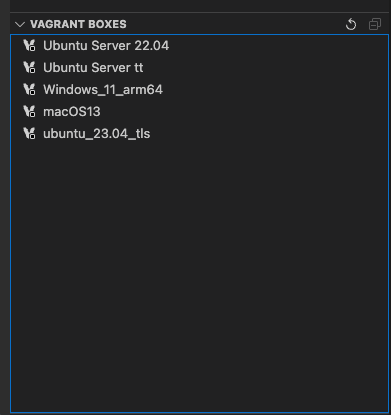

# Parallels Desktop for VS Code

 

This extension allows you to manage a wide range of operations for your Virtual appliances

> **Attention** This extension will only work on Apple Mac

## Features

### Manage Groups

Groups will allow a better management of your virtual machines, you can create groups, rename them, start/stop all machines in a group and create group snapshots. This will allow you to have a better overview of your virtual machines and their state.  

Main features:

* Create groups for easier management of your virtual machines
* Create group snapshots
* Start/stop group virtual machines
* Visual Cue for machine state in groups

### Manage Virtual Machines Lifecycle

Know instantly what is the state of your virtual machines, start, stop, pause, suspend and take snapshots of your virtual machines. This will allow you to have a better overview of your virtual machines and their state.

Main features:

* Start, stop, pause, suspend Machines
* Visual Cue for machine state
* Show IP Address of the machine if it is available

### Rename Virtual Machines and Groups

Easily rename your virtual machines and groups, this will allow you to have a better overview of your virtual machines and their state.

### Manage Virtual Machine Snapshots

Snapshots are a great way to save the state of your virtual machine, you can create snapshots, restore to a snapshot and delete snapshots. This will allow you to have a better overview of your virtual machines and their state.

Main features:

* Create a snapshot
* Restore machine to a snapshot
* Delete a snapshot
* Visual Cue of snapshot tree

### Creating Virtual Machines

Quickly create a new virtual machine, you can choose from a wide range of appliances and customize the virtual machine to your needs. This will allow you to have a better control on the Vms you need.

* Adding new custom Virtual Machines
* Use "Addons" to get pre installed applications
* Wide range of appliances and growing
* Open source for community expansion
* Use any Iso/IPSW file to create a new Virtual Machine

### Manage Docker Containers inside Virtual Machines

You can use this extension to manage and create Docker containers inside your virtual machines, this will allow you to quickly create and manage containers without the need to open a window (Machine needs to be running).

Main features:

* Create Docker containers from a wide range of images or your own
* Start/Stop Docker containers
* Remove Docker containers
* Visual Cue for container state
* List all Docker images
* Remove Docker images

### Manage visibilities of Virtual Machines or Groups

We know sometimes we can just have a lot of virtual machines and we don't want to see them all, so we added the ability to hide/show virtual machines or groups, this will improve decluttering your virtual machines list. You can quickly see everything with a click of a button.

### Vagrant Boxes Management

We added a simple way to manage your Vagrant Boxes, you can quickly see all the boxes you have installed, delete them or init a new one.

Main features:

* List all available Vagrant Boxes
* Init Vagrant Box
* Delete Vagrant Box

## Requirements

You will need to be on Apple Mac and own a license of Parallels Desktop Pro or Business Edition, find more information [here](https://www.parallels.com/uk/products/desktop/pro/)

## Extension Settings

This extension contributes the following settings:

* `parallels-desktop.output_path`: Output path for the packer machines.
* `parallels-desktop.prlctl.path`: Path for your Parallels Desktop Command Line installation.
* `parallels-desktop.extension.path`: Path for the extension.
* `parallels-desktop.extension.download.path`: Path for the extension cached downloads.
* `parallels-desktop.hashicorp.vagrant.boxes.path`: Path for the vagrant boxes.
* `parallels-desktop.vagrant.path`: Path for the vagrant tool.
* `parallels-desktop.hashicorp.packer.path`: Path for the packer tool.
* `parallels-desktop.git.path`: Path for the git tool.
* `parallels-desktop.brew.path`: Path for the brew tool.
* `parallels-desktop.extension.refresh.auto`: Auto refresh the virtual machine extension.
* `parallels-desktop.extension.refresh.interval`: Interval for the auto refresh.
* `parallels-desktop.tree.show-hidden-items`: Always show hidden items in the tree view.
* `parallels-desktop.extension.order-items-alphabetically`: Order items alphabetically.
* `parallels-desktop.extension.show-flat-snapshot-tree`: Show flat snapshot tree.
* `parallels-desktop.extension.start-machines-headless-by-default`: Start machines headless by default.

> Tip: The extension will use default values that will work on most cases and it will try to install all of the dependencies

## Issues

This extension is still in development, so please refer to our [issue tracker](https://github.com/Parallels/parallels-vscode-extension/issues) for known issues, and please contribute with additional information if you encounter an issue yourself.

## Contribute

If you're interested in contributing, or want to explore the source code of this extension yourself, see our [contributing guide](CONTRIBUTING.md), which includes:

* [Prerequisites for running and testing code](CONTRIBUTING.md#prerequisites-for-running-and-testing-code)
* [Submitting a pull request](CONTRIBUTING.md#submitting-a-pull-request)
* [Dev loop & Testing changes](CONTRIBUTING.md#dev-loop-testing-changes)
* [Npm Commands](CONTRIBUTING.md#npm-commands)
* [Build](CONTRIBUTING.md#build)
* [Run Tests](CONTRIBUTING.md#run-tests)
